# User Service — Architecture, Improvement Plan & Workflows

> **Bookstore Microservices Platform**  
> Service: `user-service` · Port: `8085` · Database: `users-db` (PostgreSQL, host port `55432`)

---

## Table of Contents

1. [Overview](#1-overview)
2. [Current State](#2-current-state)
3. [Target Architecture](#3-target-architecture)
4. [Database Design](#4-database-design)
5. [Configuration & Dependencies](#5-configuration--dependencies)
6. [Planned API Contract](#6-planned-api-contract)
7. [Security Model](#7-security-model)
8. [Platform Integration](#8-platform-integration)
9. [Improvement Plan](#9-improvement-plan)
10. [Workflows & Diagrams](#10-workflows--diagrams)
11. [Testing Strategy](#11-testing-strategy)
12. [Operations & DevOps](#12-operations--devops)
13. [References](#13-references)

---

## 1. Overview

### Purpose

`user-service` is the **identity and authentication microservice** for the bookstore platform. It is responsible for:

| Responsibility | Description |
|----------------|-------------|
| **User registration** | Create local accounts with hashed passwords |
| **Authentication** | Validate credentials and issue JWT access tokens |
| **User profile** | Expose current-user information (`/me`) |
| **Authorization foundation** | Embed roles in JWT for downstream services |
| **SSO readiness** | Schema supports LOCAL and external providers (Google, GitHub, etc.) |

### Position in the Platform

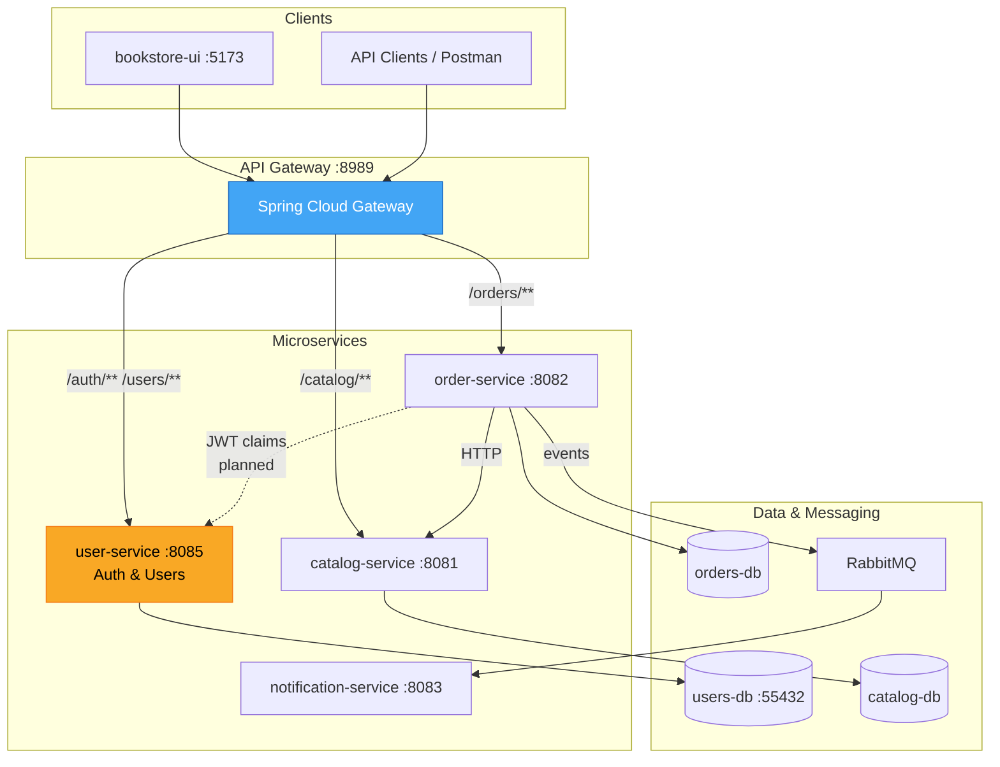

### Service Metadata

| Property | Value |
|----------|-------|
| **Artifact** | `com.arjun:user-service` |
| **Spring Boot** | 3.5.0 |
| **Java** | 21 |
| **Package (current)** | `com.arjun.user_service` |
| **Package (target)** | `com.arjun.user_service.bookstore.users` |
| **Docker image (configured)** | `arjundocker7000/bookstore-user-service` |

---

## 2. Current State

### Implementation Status

> **Status: Scaffold only — not production-ready**

The service has infrastructure and dependency declarations but **no business logic**.

| Layer | File / Location | Status |
|-------|-----------------|--------|
| Bootstrap | `UserServiceApplication.java` | ✅ Exists |
| REST controllers | — | ❌ Missing |
| JPA entities | — | ❌ Missing |
| Repositories | — | ❌ Missing |
| Domain services | — | ❌ Missing |
| Security config | — | ❌ Missing |
| JWT service | — | ❌ Missing (jjwt on classpath, unused) |
| DTOs & validation | — | ❌ Missing |
| Exception handler | — | ❌ Missing |
| Flyway migration | `V1_create_users_table.sql` | ⚠️ Naming bug |
| Integration tests | `contextLoads()` only | ⚠️ Minimal |
| API Gateway route | — | ❌ Missing |
| Docker app container | — | ❌ Missing |
| CI workflow | — | ❌ Missing |

### Current Source Tree

```
user-service/
├── pom.xml
├── src/main/java/com/arjun/user_service/
│   └── UserServiceApplication.java          ← only production class
├── src/main/resources/
│   ├── application.properties
│   └── db/migration/
│       └── V1_create_users_table.sql        ← invalid Flyway name
└── src/test/java/com/arjun/user_service/
    ├── UserServiceApplicationTests.java
    ├── TestcontainersConfiguration.java
    └── TestUserServiceApplication.java
```

### Gap vs. Sibling Services

`catalog-service` and `order-service` follow a mature layered pattern that `user-service` should adopt:

```
bookstore/
├── catalog/   → domain, web, config
├── orders/    → domain, web, clients, config, jobs
└── users/     → domain, web, security, config   ← to be created
```

---

## 3. Target Architecture

### Internal Layered Design

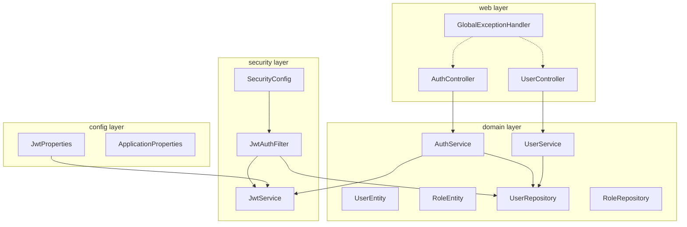

### Target Package Structure

```
com.arjun.user_service.bookstore.users/
├── config/
│   ├── ApplicationProperties.java
│   └── JwtProperties.java
├── domain/
│   ├── UserEntity.java
│   ├── RoleEntity.java
│   ├── UserRepository.java
│   ├── RoleRepository.java
│   ├── AuthService.java
│   ├── UserService.java
│   └── exception/
│       ├── UserNotFoundException.java
│       ├── DuplicateUserException.java
│       └── InvalidCredentialsException.java
├── security/
│   ├── SecurityConfig.java
│   ├── JwtService.java
│   ├── JwtAuthFilter.java
│   └── UserPrincipal.java
└── web/
    ├── AuthController.java
    ├── UserController.java
    ├── dto/
    │   ├── RegisterRequest.java
    │   ├── LoginRequest.java
    │   ├── AuthResponse.java
    │   └── UserResponse.java
    └── exception/
        └── GlobalExceptionHandler.java
```

---

## 4. Database Design

### Infrastructure

| Container | Image | Host Port | Service Name |
|-----------|-------|-----------|--------------|
| `users-db` | `postgres:16-alpine` | `55432` | `users-db` (Docker network) |

Defined in: `deployment/docker-compose/infra.yml`

### Current Schema (`users` table)

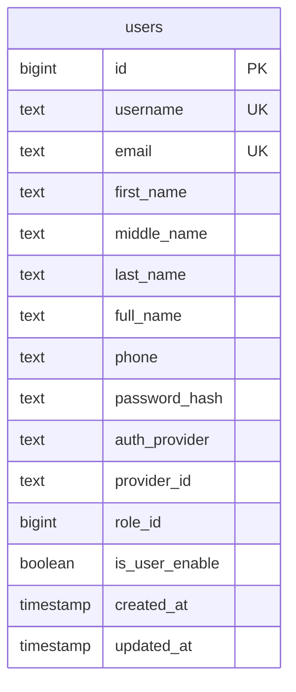

**Sequence:** `user_id_seq` — `START 1 INCREMENT 50` (matches catalog/order JPA batch sizing)

**Constraints (good design):**
- `chk_local_has_password` — LOCAL users must have `password_hash`
- `chk_sso_has_provider_id` — SSO users must have `provider_id`
- Partial unique index `uq_users_sso_identity` on `(auth_provider, provider_id)`

### Schema Issues to Fix

| Issue | Current | Recommended |
|-------|---------|-------------|
| Flyway filename | `V1_create_users_table.sql` | `V1__create_roles_table.sql`, `V2__create_users_table.sql` |
| Roles | `role_id DEFAULT 1`, no `roles` table | Add `roles` table + seed `USER`, `ADMIN` |
| Column name | `is_user_enable` | Rename to `enabled` |
| Default enabled | `FALSE` | `TRUE` for successful LOCAL registration |
| FK | None on `role_id` | `REFERENCES roles(id)` |

### Target Schema

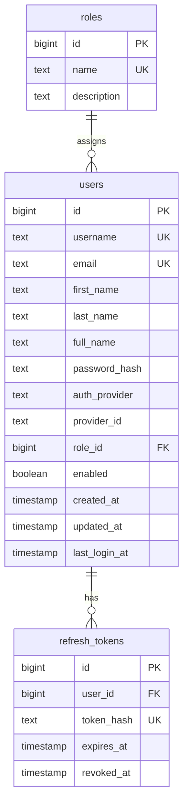

---

## 5. Configuration & Dependencies

### Application Properties

| Key | Default | Notes |
|-----|---------|-------|
| `server.port` | `8085` | |
| `spring.datasource.url` | `jdbc:postgresql://localhost:55432/postgres` | Override via `DB_URL` |
| `jwt.secret` | hardcoded default | **Remove default in prod** — require `JWT_SECRET` env |
| `jwt.expiration-ms` | `86400000` (24h) | Add `jwt.refresh-expiration-ms` when implementing refresh |
| `spring.jpa.show-sql` | `true` | Disable in production |
| `management.endpoints.web.exposure.include` | `*` | Restrict for auth service in prod |

### Key Maven Dependencies

| Dependency | Purpose |
|------------|---------|
| `spring-boot-starter-web` | REST API |
| `spring-boot-starter-data-jpa` | Persistence |
| `spring-boot-starter-security` | Auth framework |
| `spring-boot-starter-validation` | Bean validation |
| `spring-boot-starter-actuator` | Health & metrics |
| `flyway-core` + `flyway-database-postgresql` | Migrations |
| `jjwt-*` (0.12.6) | JWT creation & parsing |
| `springdoc-openapi` | Swagger UI |
| `micrometer-registry-prometheus` | Metrics export |
| `testcontainers` + `spring-security-test` | Integration & security tests |

---

## 6. Planned API Contract

### Endpoints

| Method | Path | Auth | Description |
|--------|------|------|-------------|
| `POST` | `/api/auth/register` | Public | Create LOCAL account |
| `POST` | `/api/auth/login` | Public | Issue access + refresh tokens |
| `POST` | `/api/auth/refresh` | Public | Rotate access token |
| `POST` | `/api/auth/logout` | JWT | Revoke refresh token |
| `GET` | `/api/users/me` | JWT | Current user profile |
| `PATCH` | `/api/users/me` | JWT | Update profile fields |

### Gateway Path Mapping (planned)

| External (Gateway) | Internal (user-service) |
|--------------------|-------------------------|
| `POST /auth/register` | `POST /api/auth/register` |
| `POST /auth/login` | `POST /api/auth/login` |
| `GET /users/me` | `GET /api/users/me` |

### Example Request / Response

**Register**
```json
POST /api/auth/register
{
  "username": "jane.doe",
  "email": "jane@example.com",
  "password": "SecureP@ss1",
  "firstName": "Jane",
  "lastName": "Doe"
}
```

**Login Response**
```json
{
  "accessToken": "eyJhbG...",
  "refreshToken": "dGhpcyBpcyBh...",
  "tokenType": "Bearer",
  "expiresIn": 86400
}
```

**Error Response (RFC 7807 ProblemDetail)**
```json
{
  "type": "https://api.bookstore.com/errors/bad-request",
  "title": "Invalid Registration Request",
  "status": 400,
  "detail": "Email already registered",
  "service": "user-service",
  "timestamp": "2026-07-13T09:00:00Z"
}
```

---

## 7. Security Model

### Authentication Flow (Target)

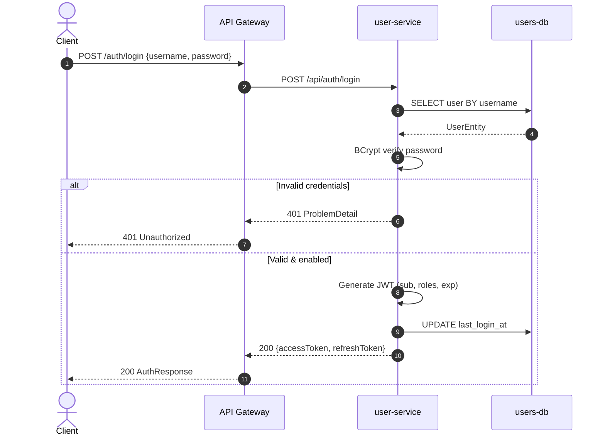

### JWT Claims (proposed)

| Claim | Value |
|-------|-------|
| `sub` | Username or user ID |
| `roles` | `["ROLE_USER"]` |
| `iss` | `user-service` |
| `exp` | Configurable via `jwt.expiration-ms` |

### Security Filter Chain (planned)

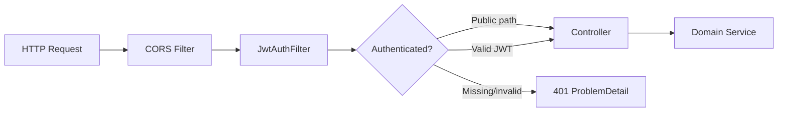

**Public paths:**
- `/api/auth/**`
- `/actuator/health`
- `/v3/api-docs/**`, `/swagger-ui/**`

**Protected paths:**
- `/api/users/**`

---

## 8. Platform Integration

### Current Integration Gaps

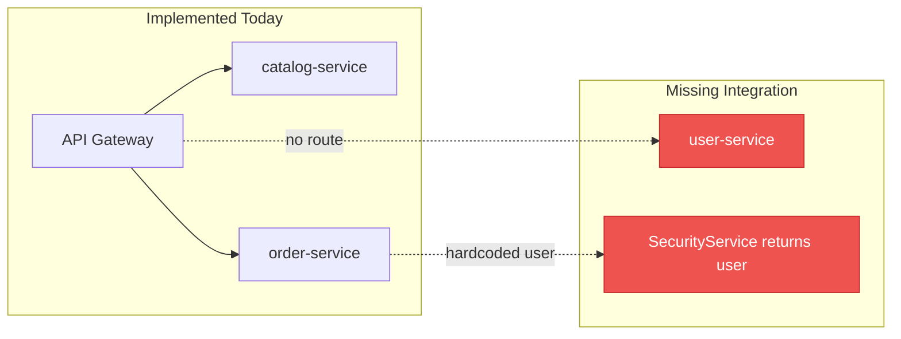

### order-service Auth Stub (must be replaced)

```java
// order-service/.../SecurityService.java — current
public String getLoginUserName() {
    return "user";  // hardcoded — all orders belong to "user"
}
```

### Target: JWT Propagation to order-service

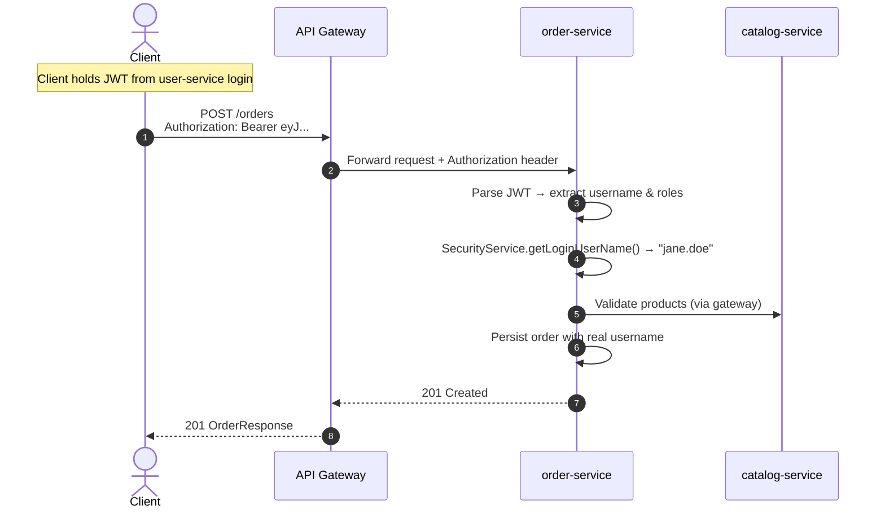

### Gateway Route (to add)

```yaml
# api-gateway/application.yml — planned addition
- id: user-service
  uri: ${USER_SERVICE_URL:http://localhost:8085}
  predicates:
    - Path=/users/**, /auth/**
  filters:
    - RewritePath=/(users|auth)/?(?<segment>.*), /api/${segment}
```

### Docker Apps (to add)

```yaml
# deployment/docker-compose/apps.yml — planned addition
user-service:
  image: arjundocker7000/bookstore-user-service
  environment:
    - SPRING_PROFILES_ACTIVE=docker
    - DB_URL=jdbc:postgresql://users-db:5432/postgres
    - JWT_SECRET=${JWT_SECRET}
  ports:
    - "8085:8085"
  depends_on:
    users-db:
      condition: service_healthy
```

---

## 9. Improvement Plan

### Phased Roadmap

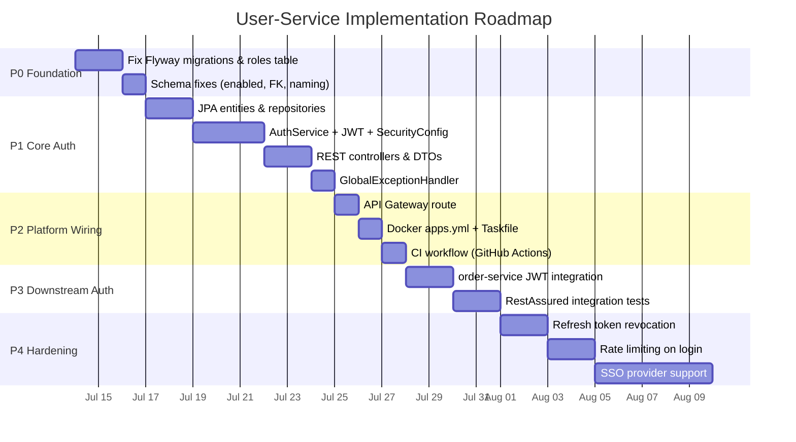

### Priority Matrix

| Priority | Item | Effort | Impact | Owner suggestion |
|----------|------|--------|--------|------------------|
| **P0** | Rename Flyway file to `V1__...` | S | Critical — migration may not run | Backend |
| **P0** | Add `roles` table + seed data | S | Unblocks authorization | Backend |
| **P0** | Fix `enabled` default & column name | S | Users can actually log in | Backend |
| **P1** | Implement register/login/JWT | M | Core service value | Backend |
| **P1** | `@ConfigurationProperties` for JWT | S | Secure config binding | Backend |
| **P1** | `GlobalExceptionHandler` (ProblemDetail) | S | API consistency | Backend |
| **P2** | Gateway `/auth/**`, `/users/**` routes | S | External access | Platform |
| **P2** | Docker + Taskfile + CI | S | Deployability | DevOps |
| **P3** | Replace order `SecurityService` stub | M | Per-user orders | Backend |
| **P3** | RestAssured IT suite | M | Regression safety | QA/Backend |
| **P4** | Refresh tokens + logout | M | Session management | Backend |
| **P4** | Login rate limiting / lockout | M | Security hardening | Security |
| **P4** | Google/GitHub SSO | L | Enterprise auth | Backend |

*Effort: S = small (1–2 days), M = medium (3–5 days), L = large (1+ week)*

### Implementation Checklist

#### P0 — Foundation
- [ ] Rename `V1_create_users_table.sql` → `V2__create_users_table.sql`
- [ ] Add `V1__create_roles_table.sql` with seed `USER` (id=1), `ADMIN` (id=2)
- [ ] Rename `is_user_enable` → `enabled`, default `TRUE` after email verification (or `TRUE` for MVP)
- [ ] Add FK `users.role_id → roles.id`

#### P1 — Core Implementation
- [ ] Create `UserEntity`, `RoleEntity` with sequence generator (mirror `ProductEntity`)
- [ ] Create `UserRepository`, `RoleRepository`
- [ ] Implement `JwtService` using jjwt 0.12.6
- [ ] Implement `SecurityConfig` with stateless JWT filter
- [ ] Implement `AuthController` (register, login, refresh)
- [ ] Implement `UserController` (`GET/PATCH /me`)
- [ ] Add `BCryptPasswordEncoder`
- [ ] Remove hardcoded JWT secret default from properties

#### P2 — Platform Wiring
- [ ] Add gateway route for user-service
- [ ] Add `USER_SERVICE_URL` to gateway Docker env
- [ ] Add user-service to `deployment/docker-compose/apps.yml`
- [ ] Add user-service build task to `Taskfile.yml`
- [ ] Create `.github/workflows/user-service.yml`
- [ ] Add `application-docker.properties` profile

#### P3 — Integration & Tests
- [ ] Update `order-service` `SecurityService` to parse JWT
- [ ] Add `AbstractIT` + RestAssured tests (mirror catalog-service)
- [ ] Add security tests with `@WithMockUser` / JWT test utils
- [ ] Pin Testcontainers to `postgres:16-alpine`

#### P4 — Hardening (future)
- [ ] Refresh token table + revocation
- [ ] Account lockout after N failed attempts
- [ ] Email verification workflow
- [ ] OAuth2 / SSO login endpoints
- [ ] Restrict actuator exposure in production

---

## 10. Workflows & Diagrams

### 10.1 Registration Workflow

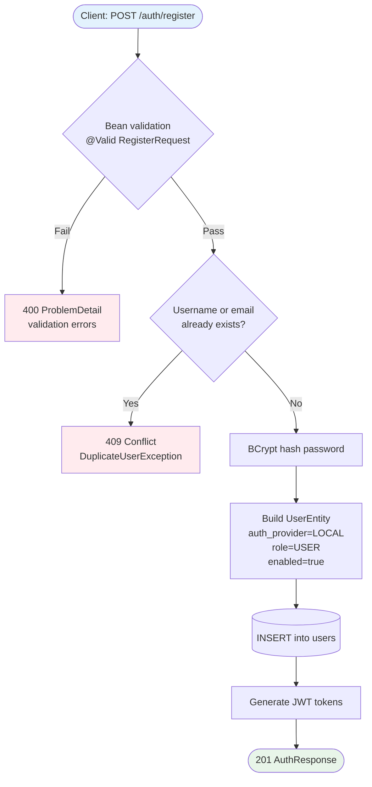

### 10.2 Authenticated Request Workflow

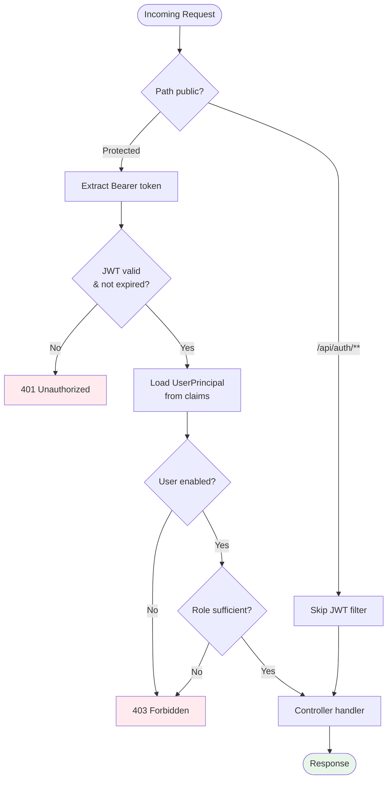

### 10.3 End-to-End Platform Request Flow (Target State)

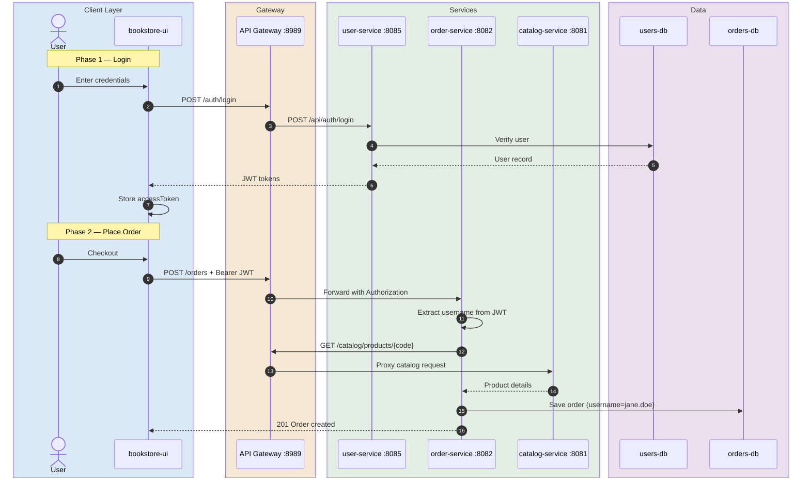

### 10.4 Development Workflow

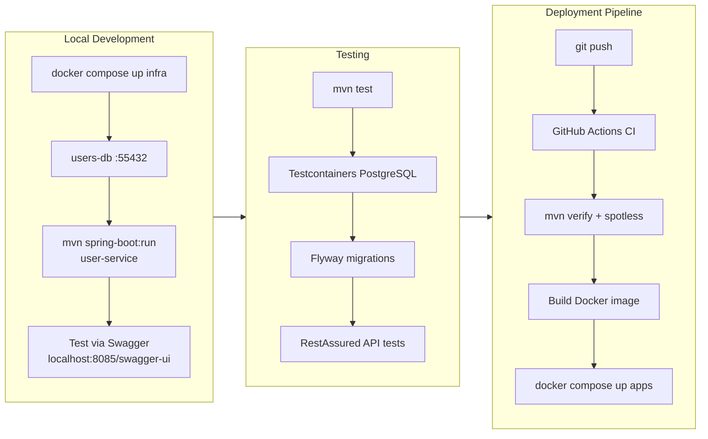

### 10.5 CI/CD Pipeline (Planned)

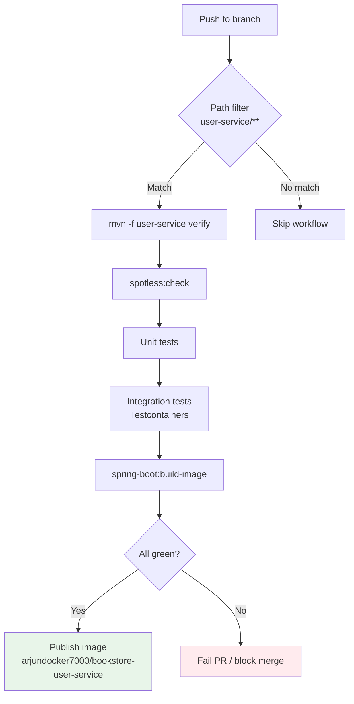

### 10.6 Data Migration Workflow

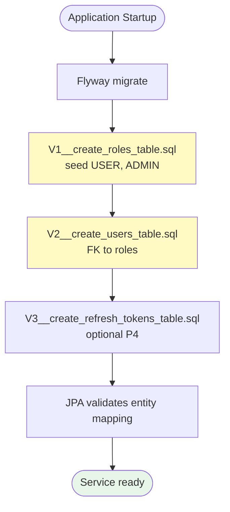

---

## 11. Testing Strategy

### Test Pyramid (Target)

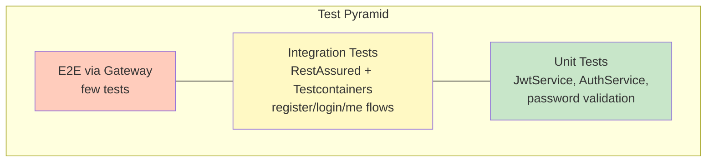

### Recommended Test Cases

| Test | Type | Description |
|------|------|-------------|
| `contextLoads` | Smoke | Spring context starts (exists today) |
| `flywayMigrationsApply` | Integration | All migrations run on empty DB |
| `registerSuccess` | API IT | 201 + tokens returned |
| `registerDuplicateEmail` | API IT | 409 conflict |
| `loginValidCredentials` | API IT | 200 + JWT structure valid |
| `loginInvalidPassword` | API IT | 401 unauthorized |
| `loginDisabledUser` | API IT | 403 forbidden |
| `getMeWithValidJwt` | API IT | 200 user profile |
| `getMeWithoutJwt` | Security | 401 unauthorized |
| `jwtExpiredToken` | Security | 401 unauthorized |

### Test Infrastructure (mirror catalog-service)

```java
@SpringBootTest(webEnvironment = SpringBootTest.WebEnvironment.RANDOM_PORT)
@Import(TestcontainersConfiguration.class)
public abstract class AbstractIT {
    @LocalServerPort int port;
    @BeforeEach void setUp() { RestAssured.port = port; }
}
```

Use `postgres:16-alpine` in Testcontainers (not `postgres:latest`).

---

## 12. Operations & DevOps

### Health & Observability

| Endpoint | Purpose |
|----------|---------|
| `/actuator/health` | Liveness / readiness |
| `/actuator/info` | Build & git info |
| `/actuator/prometheus` | Metrics scrape target |
| `/swagger-ui.html` | API documentation |

### Environment Variables

| Variable | Required | Description |
|----------|----------|-------------|
| `DB_URL` | Prod: Yes | JDBC connection string |
| `DB_USERNAME` | Prod: Yes | Database user |
| `DB_PASSWORD` | Prod: Yes | Database password |
| `JWT_SECRET` | Prod: Yes | HS256 signing key (≥256 bits) |
| `JWT_EXPIRATION_MS` | No | Access token TTL (default 24h) |

### Run Locally

```bash
# 1. Start infrastructure
docker compose -f deployment/docker-compose/infra.yml up -d users-db

# 2. Run service (from user-service directory)
cd user-service
./mvnw spring-boot:run

# 3. Verify health
curl http://localhost:8085/actuator/health
```

### Production Hardening Checklist

- [ ] `JWT_SECRET` from secrets manager (never in source)
- [ ] Actuator limited to `health,info,metrics,prometheus`
- [ ] `spring.jpa.show-sql=false`
- [ ] HTTPS termination at gateway
- [ ] CORS restricted to known origins
- [ ] Login rate limiting (bucket4j or gateway filter)

---

## 13. References

### Project Files

| Resource | Path |
|----------|------|
| Main application | `user-service/src/main/java/.../UserServiceApplication.java` |
| Configuration | `user-service/src/main/resources/application.properties` |
| Migration | `user-service/src/main/resources/db/migration/` |
| POM | `user-service/pom.xml` |
| Users database (Docker) | `deployment/docker-compose/infra.yml` |
| API Gateway routes | `api-gateway/src/main/resources/application.yml` |
| Order auth stub | `order-service/.../SecurityService.java` |
| Reference: catalog patterns | `catalog-service/src/main/java/.../bookstore/` |
| Reference: order patterns | `order-service/src/main/java/.../bookstore/` |
| Reference: exception handler | `order-service/.../GlobalExceptionHandler.java` |

### Sibling Service Ports

| Service | Port |
|---------|------|
| api-gateway | 8989 |
| catalog-service | 8081 |
| order-service | 8082 |
| notification-service | 8083 |
| **user-service** | **8085** |

### External Documentation

- [Spring Security — JWT](https://docs.spring.io/spring-security/reference/servlet/oauth2/resource-server/jwt.html)
- [JJWT 0.12.x](https://github.com/jwtk/jjwt)
- [Flyway naming conventions](https://documentation.red-gate.com/fd/migrations-184127470.html)
- [RFC 7807 Problem Details](https://datatracker.ietf.org/doc/html/rfc7807)

---

## Document History

| Version | Date | Author | Changes |
|---------|------|--------|---------|
| 1.0 | 2026-07-13 | Platform team | Initial documentation — current state analysis, improvement plan, workflows |

---

*This document reflects the **as-is** scaffold state and the **to-be** target architecture. Update sections 2, 6, and 9 as implementation progresses.*
